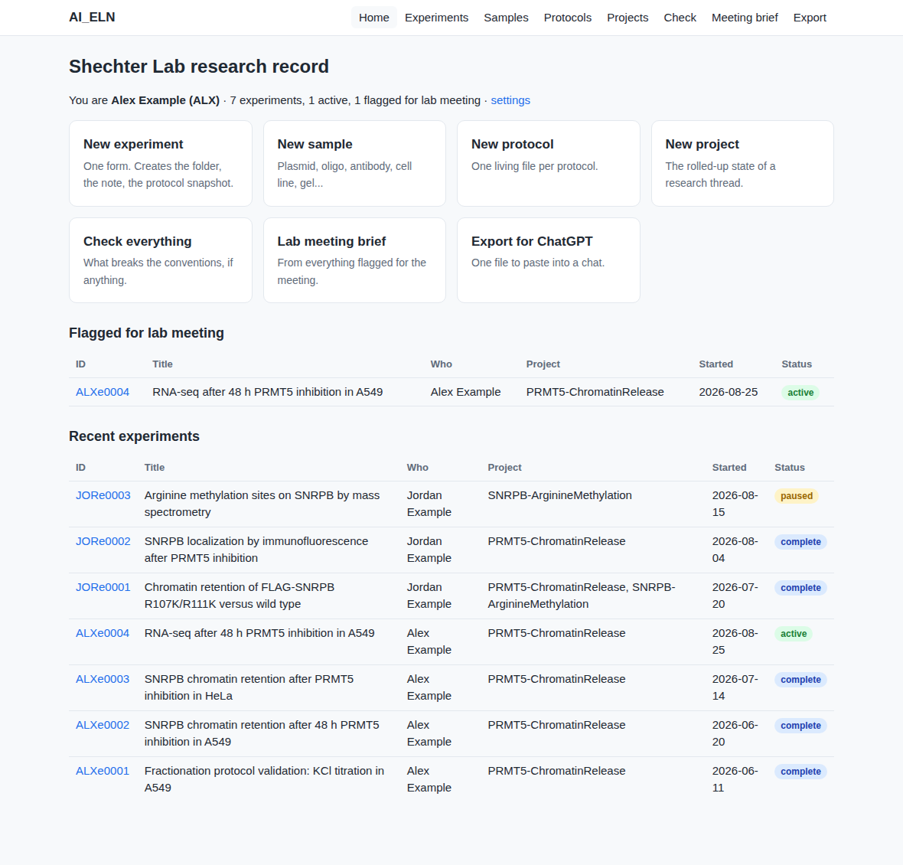
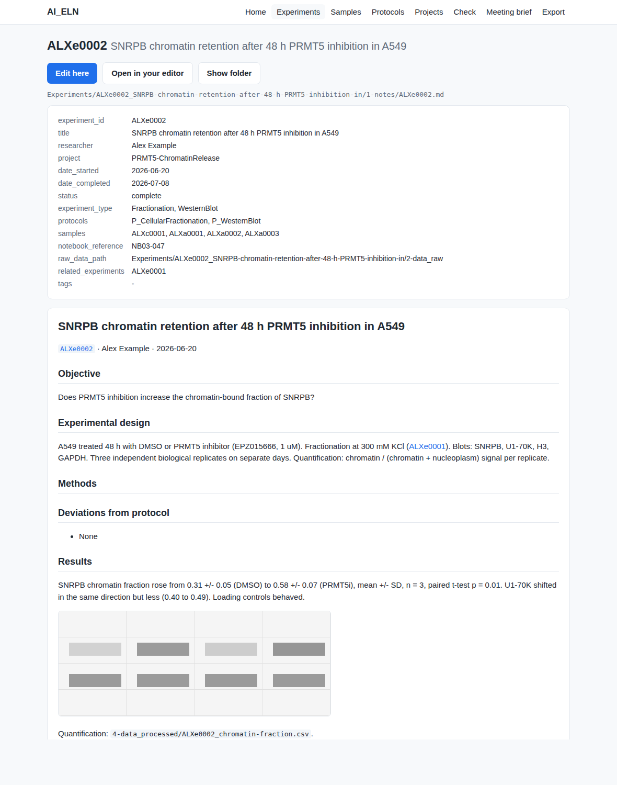

# AI_ELN — the Shechter Lab research record

A lab notebook made of plain files in plain folders. Every experiment gets a
stable ID, the same five subfolders, and one Markdown note with a short
header. Because the structure never varies, a person can find anything in
seconds, a spreadsheet can index it, and an AI assistant can read it and
cite the exact experiment a claim came from.

No accounts, no plugins, no database, no API keys, nothing to install
beyond Python (already on every Mac). If you can fill in a form and type
in a text box, you can use this.

## What you actually do

1. **Double-click `launchers/Open ELN`.** A page opens in your browser
   (it runs on your own computer; nothing is uploaded anywhere).
2. **Click New experiment, type a title, click Create.** The folder, the
   note, the protocol snapshot, and the inventory row are made for you.
3. **Click Edit here and write.** Objective before you start; Results,
   Interpretation, Decision when you have them.
4. **Drop files into the subfolders**, named with the experiment ID in
   front: `JSRe0002_R_blot-quantification.png` into `5-figures/`. Raw
   instrument files go into `2-data_raw/` untouched. **Show folder** opens it.

That is the whole habit. **Check** tells you if anything is misnamed or
missing; **Meeting brief** writes the summary for the next lab meeting
from whatever you flagged. Practice first on fictional data with
`launchers/Try the Sandbox`.



The page is one dependency-free Python file reading and writing the same
plain files as everything else. Terminal-window launchers (`New
Experiment`, `Check Everything`, ...) and a command line do the same
things for people who prefer them. Mac users right-click → Open a launcher
the first time; Windows needs Python installed once. See
[`docs/getting-started.md`](docs/getting-started.md).

## Where it lives

The whole thing is **one folder**: these tools, the templates, and the
lab's `Experiments/`, `Protocols/`, `Samples/`, `Projects/`. Put that
folder in the lab's Dropbox or OneDrive and everyone who syncs it has the
record and the tools. There is no server, no database, no git, and no
central copy; the synced folder *is* the record, and every file in it is
plain text (Markdown with a small header, CSV, JSON) or a standard image.
If every script here vanished tomorrow, the notes would still be complete
and readable in any editor.

Sync conflicts are two readable copies, never a corrupted database, and
**Check** points them out. This GitHub repository is only where the tools
are developed; nobody in the lab needs it day to day.

## The whole system on one screen

```
Experiments/
└── JSRe0002_SNRPB-chromatin-retention-KCl-titration/
    ├── 1-notes/            JSRe0002.md  +  JSRe0002_P_WesternBlot_20260901.md (protocol as run)
    ├── 2-data_raw/         instrument output, never renamed, never edited
    ├── 3-code/             JSRe0002_analysis.R
    ├── 4-data_processed/   JSRe0002_quantification.csv
    └── 5-figures/          JSRe0002_R_fractionation-KCl_20260904.png   <- the one you show in lab meeting
Protocols/    P_WesternBlot.md          one living file per protocol
Samples/      JSRp0001.md               plasmids, oligos, antibodies, cell lines, gels...
Projects/     PRMT5-ChromatinRelease.md rolled-up state of a research thread, citing experiment IDs
Inventory/    *.csv                     generated index of all of the above; open in Excel
```

| Thing | ID looks like | Made by |
|---|---|---|
| Experiment | `JSRe0002` | New experiment |
| Sample | `JSRp0001` (p plasmid, i oligo, a antibody, c cell line, g gel, ...) | New sample |
| Protocol | `P_WesternBlot` | New protocol |
| Project | `PRMT5-ChromatinRelease` | New project |

The initials are yours, so numbering never collides with anyone else's. An
ID written anywhere is a link. The complete rules fit on one page:
[`docs/CONVENTIONS.md`](docs/CONVENTIONS.md). The one-page version to pin
above your bench: [`docs/CHEATSHEET.md`](docs/CHEATSHEET.md).

Every note starts with a header like this, which is what makes the record
searchable and what the AI reads first:

```yaml
---
type: experiment
experiment_id: JSRe0002
title: SNRPB chromatin retention after PRMT5 inhibition
researcher: Jacob Roth
project: [PRMT5-ChromatinRelease]
date_started: 2026-09-01
status: active            # active | complete | paused | abandoned
protocols: [P_WesternBlot]
samples: [JSRp0001, JSRa0003]
tags: [meeting]           # flag for the next lab meeting
---
```



## Using AI with it

Everything here works with the ChatGPT site license or a Claude
subscription. Nothing needs an API key.

- **ChatGPT, copy and paste.** Click **Export**, pick a project (or all
  active experiments), click **Copy all**, paste into a chat. The export
  contains the notes, everything they reference, and a short primer on
  how to read them. Ask: *summarize what we know, citing experiment IDs*;
  *draft a results paragraph for JSRe0002*; *which experiments used
  JSRa0003?* Once, paste [`docs/ai-briefing.md`](docs/ai-briefing.md) as
  the instructions of a ChatGPT Project so every chat already knows the rules.
- **Codex, Claude Code, Cowork, Gemini CLI.** Open the tool inside this
  folder. It reads [`AGENTS.md`](AGENTS.md) (the lab's rules: cite IDs,
  never invent a result, create experiments only through the tool) and the
  skills in [`.agents/skills/`](.agents/skills/README.md): how to record an
  experiment, how to search and cite, how to synthesize a project page,
  plus vendored methodology skills from
  [K-Dense](https://github.com/K-Dense-AI/scientific-agent-skills)
  (experimental design, statistics, scientific writing, citations,
  LabArchives), pinned to a release and updated only by a reviewed diff.

[`sandbox/PILOT.md`](sandbox/PILOT.md) shows what those skills produced
when run against the fictional sandbox. Details and reasoning:
[`docs/ai-agents.md`](docs/ai-agents.md).

## Keeping it honest

**Check** (or `python3 scripts/eln.py validate`) reads every note and
folder and reports what breaks the conventions: a misnamed folder, a
missing subfolder, a `status` that isn't one of the four, a sample ID that
points at nothing, a figure without the experiment ID in front. Errors
fail; warnings are advice. It also spots sync-conflict copies. Run it
before lab meeting and before handing a folder to anyone. Every change to
the tools is tested on macOS, Windows, and Linux, including a strict check
of the sandbox record.

## For people who like a terminal

Everything the page does is one script with no dependencies:

```bash
python3 scripts/eln.py init                                  # once: initials, name, where files live
python3 scripts/eln.py new experiment --title "..." --project PRMT5-ChromatinRelease --protocol P_WesternBlot
python3 scripts/eln.py new sample --type plasmid --title "pcDNA3-FLAG-SNRPB"
python3 scripts/eln.py validate --strict
python3 scripts/eln.py find --status active --tag meeting
python3 scripts/eln.py index                                 # regenerate Inventory/*.csv
python3 scripts/eln.py report                                # Markdown brief for lab meeting
python3 scripts/eln.py export --project PRMT5-ChromatinRelease --out brief.md
python3 scripts/eln_web.py                                   # the page, by hand
```

`--help` on any command. The record is the folder the tools sit in;
`init --root` is only for the unusual case of keeping notes elsewhere.
Tests: `python3 -m unittest discover -s tests`.

## Read more

- [`docs/getting-started.md`](docs/getting-started.md) — first day, step by step, with pictures
- [`docs/CHEATSHEET.md`](docs/CHEATSHEET.md) — one printable page
- [`docs/CONVENTIONS.md`](docs/CONVENTIONS.md) — the rules, precisely
- [`docs/SOP.md`](docs/SOP.md) — what's required, what's flexible, what happens when an experiment is done
- [`docs/ai-agents.md`](docs/ai-agents.md) / [`docs/ai-briefing.md`](docs/ai-briefing.md) — AI without API keys
- [`sandbox/`](sandbox/README.md) — fictional record to practice on; [`sandbox/PILOT.md`](sandbox/PILOT.md) is the AI features run against it
- [`docs/design-notes.md`](docs/design-notes.md) — why it's shaped this way; where LabArchives fits
- [`reference/jacob-original-system/`](reference/jacob-original-system/) — the spreadsheet-and-folders system by Jacob Roth that this is a direct translation of

## Credits

The information architecture — one ID per experiment, five fixed
subfolders, IDs for every gel and plasmid, a results file you can find in
one search — is Jacob Roth's. This repo turns it into plain Markdown with a
header, adds a tool that enforces the conventions and a page that makes it
point-and-click, and makes the whole thing readable by AI.
