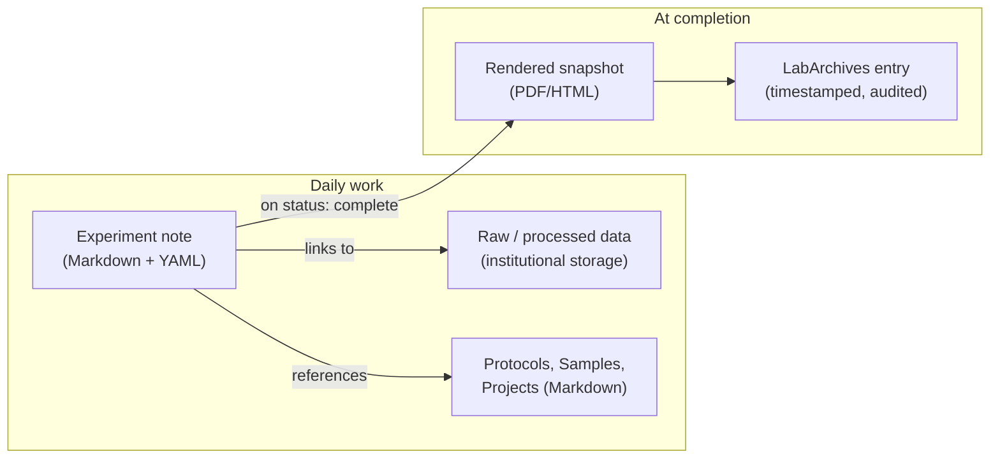

# Design notes: why this is shaped the way it is

This explains the reasoning behind the system in this repo. If you just want
to use it, see [`getting-started.md`](getting-started.md) instead — this
document is for when you're curious, or deciding whether to change something.

## The decision this repo makes

There were two tempting, wrong defaults: adopt an existing Obsidian ELN
plugin wholesale, or keep using LabArchives as the daily working tool. This
repo does neither. Instead:

> **Jacob's experiment-centric model + Markdown as the working format +
> institutional storage for data + LabArchives as the archival record.**

## What Jacob's system already solved

Every experiment gets, from the start: a unique ID, a standardized folder
(`1-notes / 2-data_raw / 3-code / 4-data_processed / 5-figures`), explicit
separation of raw vs. processed data, stable IDs for recurring physical
objects (gels, plasmids, oligos, slides), and a short results summary
written while the experiment is still fresh. That's the hard part of an
ELN — the information architecture — and it was solved with a spreadsheet
and a folder-naming convention, not software. See
[`reference/jacob-original-system/`](../reference/jacob-original-system/)
for the originals.

This repo's job is narrower than it sounds: **represent that structure in
Markdown + YAML**, so it becomes searchable, linkable, and AI-readable,
without asking anyone to give up the parts that already work.

## Why not just adopt an existing Obsidian ELN plugin

[`fcskit/obsidian-eln`](https://github.com/fcskit/obsidian-eln) is a
reasonable source of ideas — its Resources → Processes → Samples → Analyses
model, structured note templates, and Dataview-generated tables are worth
borrowing individual pieces from. But it's built around analytical/materials
workflows, depends on a fairly large stack of community plugins, and its
dedicated plugin is still pre-1.0. Adopting its full taxonomy would mean
bending a molecular biology lab's actual workflow to fit someone else's
schema, and adding fragility (plugin updates, compatibility) for features
most of the lab wouldn't use. Borrow components; don't adopt the vault.

## Data lives outside the notebook

The repo should contain Markdown, YAML, small tables, compressed
representative images, protocol PDFs, and analysis code. It should not
contain microscopy datasets, sequencing files, mass spec output, uncropped
Western scans, or GraphPad/Illustrator source files duplicated across
locations. Git and Markdown are excellent for text and code and poor for
large binaries — large files belong on institutionally backed-up storage
(OneDrive/SharePoint or a departmental server), with the experiment note
recording the canonical path (`raw_data_path` in the YAML front matter).

A minimal manifest per experiment (which raw file produced which processed
file produced which figure) is what makes "what data supports this figure"
an answerable question later, whether by a person or an AI assistant. This
repo doesn't enforce that yet — it's the natural next step once the basic
note-taking habit is established (see Phase 4 below).

## Obsidian is a view, not the database

The durable asset is the Markdown/YAML file, not anything Obsidian-specific.
That's why the templates avoid `[[wiki-link]]`-heavy syntax and Obsidian-only
features by default: plain Markdown stays readable in any editor, greppable
from the command line, parseable by a two-line Python script, and diffable
in Git, none of which survive a switch away from a proprietary note format.
Opening this repo folder as an Obsidian vault is entirely optional and adds
backlinks/graph view/Dataview on top — it changes nothing about the files
themselves.

## The role of LabArchives

LabArchives is kept, but demoted from working environment to archival
layer. What it actually provides — institutional authentication, controlled
permissions, audit trails, timestamps, a defensible record for disputes or
patents — has nothing to do with day-to-day usability, and its interface
cost shouldn't be paid for every experiment note. The intended flow:

1. Work happens in Markdown, all week, with zero LabArchives interaction.
2. When an experiment is marked `status: complete`, its note is rendered to
   PDF/HTML and deposited into LabArchives under the same experiment ID.
3. LabArchives becomes a timestamped snapshot — the institutional record —
   while Markdown stays the actively-edited source of truth.

This is one-directional by design (Markdown → LabArchives, never the
reverse). Bidirectional sync creates ambiguity about which copy is
authoritative; a snapshot doesn't. LabArchives exposes an API (the
NIMH-supported `labapi` Python client can authenticate, create pages, and
upload structured content), which is what an automated bridge would build
on — API access needs to be enabled by the institutional administrator
first, and this repo doesn't build that bridge yet (Phase 3 below).

## Collaboration model

A single shared vault for the whole lab invites merge conflicts and lets
every trainee's daily scratch notes clutter the shared graph. The intended
split:

- **Shared:** protocols, sample/reagent records, project summaries, lab
  policies, completed experiment notes.
- **Individual:** active/in-progress experiments, daily notes, half-formed
  interpretations — promoted into the shared area on completion.

Sync should go through institutionally managed storage (OneDrive/SharePoint)
or a private institutional Git host — not a public GitHub repo, and not
ad hoc file copying.

## AI integration, in stages

AI is valuable here specifically because Markdown + YAML is structured
enough to filter before it's searched semantically (by researcher, project,
reagent, date, status) and because every claim can cite an experiment ID
instead of being a free-floating chatbot answer.

1. **Assisted writing within one note** — turn observations into a Results
   section, draft a lab-meeting summary, compare this experiment to named
   related ones. Scoped to one note plus its explicit links, not the whole
   vault.
2. **Lab-wide semantic search** — "which experiments tested SNRPB
   R107/R111," "what dilution of this antibody worked," filtered by the
   YAML fields before any semantic matching happens.
3. **Automated project synthesis** — a continuously regenerated
   current-state summary per project, every conclusion citing the
   experiment IDs that support it (`Projects/README.md` and
   `templates/project.md` are built for this).
4. **Instrument/data ingestion** — scripts that watch a drop folder, extract
   metadata, checksum and rename files by experiment ID, and update the
   note's manifest automatically. Start with Western blots or microscopy —
   frequent and easy to reason about — not sequencing or mass spec.

AI should never be the source of a conclusion; it should always be
retrieving and citing experiment records that already contain one. That's
the point of keeping the metadata structured instead of leaving everything
as free text.

## What this repo builds now vs. later

**Now (Phase 1 — this repo):** `scripts/new_experiment.py`, the four
templates, the folder scaffold, and this documentation. Enough for a small
pilot to actually run on.

**Later:**

- *Phase 2:* lab-wide rollout once the pilot's kinks are worked out — the
  SOP in [`SOP.md`](SOP.md) is written to support this.
- *Phase 3:* the LabArchives archival bridge (needs institutional API access
  first).
- *Phase 4:* semantic search and the AI layer above. Deliberately last — AI
  can't fix inconsistent IDs or missing metadata, so it isn't worth building
  until the basic habit of writing structured notes is established.

## Non-negotiables vs. flexible choices

**Required:** experiment ID, project, researcher, date, objective, raw-data
location, protocol/version, results, interpretation, status.

**Flexible:** daily-note style, prose vs. bullets, how many images, which
analysis tool (R/Python/Prism/whatever), personal task management.

The system standardizes the interface between experiments, not how any one
person thinks or writes.
