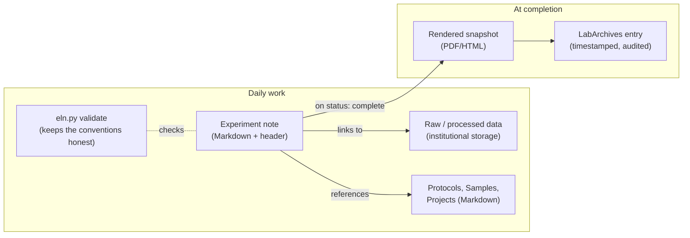

# Design notes: why this is shaped the way it is

This explains the reasoning behind the system in this repo. If you just
want to use it, see [`getting-started.md`](getting-started.md) instead;
this document is for when you're curious, or deciding whether to change
something.

## The decision this repo makes

There were three tempting, wrong defaults: adopt an ELN app or an editor
plugin wholesale, keep using LabArchives as the daily working tool, or
"just use folders" with no conventions. This repo does none of them:

> **Jacob's experiment-centric model + plain Markdown files with a small
> header + a tool that enforces the naming + institutional storage for
> data + LabArchives as the archival record.**

## What Jacob's system already solved

Every experiment gets, from the start: a unique ID, a standardized folder
(`1-notes / 2-data_raw / 3-code / 4-data_processed / 5-figures`), explicit
separation of raw vs. processed data, stable IDs for recurring physical
objects (gels, plasmids, oligos, slides), and a short results summary
written while the experiment is still fresh and findable with one search
(`JSRe####-R`). That's the hard part of an ELN — the information
architecture — and it was solved with a spreadsheet and a folder-naming
convention, not software. See
[`reference/jacob-original-system/`](../reference/jacob-original-system/).

This repo's job is narrower than it sounds: **represent that structure in
Markdown with a header, and enforce it with a tool**, so it becomes
searchable, linkable, and AI-readable without asking anyone to give up
the parts that already work.

## Conventions are the product

The metadata and the naming grammar are what everything else hangs on.
Three decisions follow from taking that seriously:

- **The header is a flat YAML subset** (`key: value`, `key: [a, b]`,
  nothing nested). It's parseable by `grep`, by ten lines of R or Python,
  by every YAML library, and by a language model reading a file cold.
  Every "we'll just add a nested field" would cost that.
- **IDs are the links.** A bare `JSRe0002` anywhere means that experiment.
  No wiki-link syntax, no paths, no editor feature required; the validator
  resolves them.
- **The tool assigns IDs and enforces the rules; it doesn't own the
  files.** `eln.py` is a few hundred lines of dependency-free Python. If it
  vanished, the files would still be a complete, readable record, and the
  one-page [`CONVENTIONS.md`](CONVENTIONS.md) is enough to rewrite it.

The validator (`eln.py validate`) is where "convention" becomes
"enforcement" — but as advice, run when you choose, with errors reserved
for things that actually break the system (a misnamed folder, a duplicate
ID) and warnings for everything else. Nothing blocks you from writing.

## What was borrowed from the mature ELNs, and what was not

The institutional ELNs (eLabFTW, RSpace, SciNote, openBIS, Chemotion) and
the plain-text notebooks that preceded this one were each read for one
question: what do they do that a folder of Markdown cannot, and does it
survive the filter of *standard files, no lock-in, easy*?

| practice | where it comes from | what this record does |
|---|---|---|
| Lock and timestamp an entry when it is finished | every institutional ELN; eLabFTW's "timestamp" | **Mark complete** writes a `sha256sum`-format manifest and a dated HTML snapshot; `verify` shows later drift. Records the state without locking anything. |
| Export a finished entry as a document | eLabFTW/RSpace PDF export; mdlabbook's HTML and PDF | `render` and the snapshot: one self-contained HTML file, images embedded, printable to PDF anywhere. |
| Exchange records between ELN systems | [the `.eln` format](https://github.com/TheELNConsortium/TheELNFileFormat), an RO-Crate ZIP that eLabFTW, RSpace, Kadi4Mat, PASTA, SampleDB, OpenSemanticLab, and SciLog import | `export --format eln`. The lock-in escape hatch: any of those systems can import this record whole, including the files and checksums. Validated with the reference RO-Crate library. |
| Templates per experiment type | eLabFTW experiment templates | `templates/experiment.{Type}.md`, optional, same header keys, only the prompts differ. |
| Link entries to items and resources | eLabFTW items, RSpace inventory, openBIS objects | The header fields `samples`, `protocols`, `project`, resolved by the validator; derived usage in the CSVs. |
| One root per project, dated and sortable, README in each directory | [Noble 2009](https://journals.plos.org/ploscompbiol/article?id=10.1371%2Fjournal.pcbi.1000424) | The five subfolders, `YYYYMMDD` in filenames, and the README each subfolder starts with. Jacob's system was this, independently. |
| Fit the discipline; meet the technical requirements; plan the rollout | [Ten simple rules for implementing ELNs](https://journals.plos.org/ploscompbiol/article?id=10.1371%2Fjournal.pcbi.1012170) (Vandendorpe et al., 2024; the three rules that could be read through this session's proxy) | Templates and sample types are molecular-biology-shaped; requirements are a browser and Python; the SOP and the sandbox are the rollout plan. |
| Keep tentative and confirmed claims apart so an AI does not conflate them | [Notes2Skills](https://arxiv.org/abs/2606.11897) (2026) | The Interpretation prompt asks for "Preliminary:" marks; the search skill and the ChatGPT briefing forbid upgrading hedges; the pilot showed it holding. |
| Dashboards over structured notes | Obsidian ELN's Dataview tables | The web page's lists and filters, and the CSVs for Excel. No plugin. |

Left out on purpose: user accounts and permissions (the sync service and
the filesystem already have them), electronic signatures and audit trails
that would need a server to be meaningful, a database, and any feature
that would make the Markdown file not the whole truth.

## Why flat files and not an app

Friction is the enemy. Every ELN the lab has tried was abandoned not
because it couldn't store things but because putting things in it felt
like work. Plain files in plain folders are the lowest-friction store
there is: Finder and Explorer are the interface, any text editor writes
the notes, and there is nothing to log into, update, or migrate. An editor
that renders Markdown nicely (VS Code, Typora, Obsidian if someone likes
it) is a view on the same files, not a requirement, and this repo avoids
editor-specific syntax so nobody is locked to one.

The cost of flat files is that nothing stops you from misnaming a folder,
and that "open the .md file" is a real barrier for some people. That's
exactly what the local web page (a form; you don't name anything; the tool
does; you can write the note on the page) and the validator (it tells you
when something's off) are for. The page owns nothing: stop it and the files
are exactly as they were.

## Data lives outside the notebook

The record should contain Markdown, small tables, compressed
representative images, protocol snapshots, and analysis code. It should
not contain microscopy datasets, sequencing files, mass spec output, or
Illustrator/Prism source files duplicated across locations. Text and code
belong in files people sync and diff; large binaries belong on
institutionally backed-up storage, with the experiment note recording the
canonical path (`raw_data_path`).

A per-experiment manifest (which raw file produced which processed file
produced which figure, with checksums) is what makes "what data supports
this figure" answerable later. This repo doesn't build it yet (Phase 4).

## The role of LabArchives

LabArchives is kept, but demoted from working environment to archival
layer. What it provides — institutional authentication, controlled
permissions, audit trails, timestamps, a defensible record — has nothing
to do with day-to-day usability, and its interface cost shouldn't be paid
for every note. Intended flow:

1. Work happens in Markdown, all week, with zero LabArchives interaction.
2. When an experiment is `status: complete`, its note is rendered to
   PDF/HTML and deposited in LabArchives under the same experiment ID.
3. LabArchives is a timestamped snapshot; Markdown stays the actively
   edited source of truth.

One-directional by design (Markdown → LabArchives, never back).
Bidirectional sync creates ambiguity about which copy is authoritative; a
snapshot doesn't. The bridge isn't built yet: it needs institutional API
access enabled first. When it is, the vendored `labarchive-integration`
skill (`.agents/skills/vendor/`) already documents the signed-request
flow, regional endpoints, and the ELN vs. Inventory API split.

## Collaboration model: one synced folder, nothing central

The deployment is one folder in the lab's Dropbox or OneDrive containing
everything: these tools, the templates, and `Experiments/`, `Protocols/`,
`Samples/`, `Projects/`. Everyone who syncs it has the whole record and
the whole toolset. There is no server, no database, no git repository, and
no central copy that is more authoritative than the one on your laptop;
the sync service is the only shared component, and it is one the lab
already pays for and already trusts with its files.

Three properties make that safe:

- **Per-researcher initials** mean two people creating experiments at the
  same moment cannot collide; there is no counter to coordinate.
- **Every file is plain text or a standard image**, so a sync conflict is
  two readable copies, never a corrupted database. Dropbox names them
  "conflicted copy"; OneDrive appends the computer name. The checker
  flags both (the first by name, the second because it no longer starts
  with the experiment ID), and the fix is to read both and keep one.
- **The inventory is derived**, so a conflicted CSV is noise: delete it and
  re-index.

This GitHub repository is where the tools are developed, not where the
record lives; nobody in the lab needs it day to day, and a `.git` folder
should never be inside the synced record (git and sync services corrupt
each other). `eln.py init --root` supports the unusual case of keeping the
notes in a different location from the tools.

## AI integration, in stages

AI is valuable here because the header is structured enough to filter
before reading, the sections are fixed enough to ask precise questions
about, and every claim can cite an experiment ID instead of floating free.
The rule throughout: **AI retrieves and cites; people conclude.**

1. **Grounded assistants, no infrastructure** — *built.* `AGENTS.md` gives
   any coding agent (Codex, Claude Code, Cowork, Gemini CLI) the lab's
   rules the moment it's opened in the folder; `.agents/skills/lab/` teaches
   the three recurring tasks (record, search-and-cite, synthesize); `eln.py
   export` plus `docs/ai-briefing.md` do the same for plain ChatGPT by copy
   and paste. No API keys — everything runs on subscriptions the lab has.
   Pinned methodology skills from K-Dense add design, statistics, writing,
   and citation guidance; see [`ai-agents.md`](ai-agents.md).
2. **Lab-wide search** — `eln.py find` and the CSV index cover filtering
   by every header field plus free text today. A semantic index only earns
   its keep when keyword search starts missing things; revisit at a few
   hundred notes.
3. **Automated project synthesis** — the `eln-project-synthesis` skill
   drafts *Current state*; a person reviews before it lands. Scheduling it
   (nightly, per project) is a small step once the pilot has notes.
4. **Instrument/data ingestion** — scripts that watch a drop folder,
   checksum and rename files by experiment ID, and write the manifest.
   Start with Western blots or microscopy.

Deliberately in that order: AI can't fix inconsistent IDs or missing
metadata, only compound them, so the conventions and the validator came
first.

## What this repo builds now vs. later

**Now (Phase 1):** conventions, the templates, `scripts/eln.py` (create,
validate, index, find, report, export as Markdown or `.eln`, complete,
verify, render), a local web page (`scripts/eln_web.py`) so nobody needs a
terminal or a Markdown editor, the double-click launchers, a fictional
sandbox to practice on, the agent instruction files and fifteen vendored
skills, tests on three operating systems. Enough for a pilot to run on.

**Later:** *Phase 2* — lab-wide rollout with the SOP once the pilot's kinks
are out. *Phase 3* — the LabArchives bridge (needs institutional API
access). *Phase 4* — ingestion and manifests; a semantic index if the vault
outgrows `find`.

## Non-negotiables vs. flexible choices

**Required:** experiment ID, project, researcher, date, objective, raw-data
location, protocol, results, interpretation, status; files named with the
ID; raw data untouched.

**Flexible:** daily-note style, prose vs. bullets, how many images, which
editor, which analysis tool (R/Python/Prism/whatever), personal task
management.

The system standardizes the interface between experiments, not how any one
person thinks or writes.
