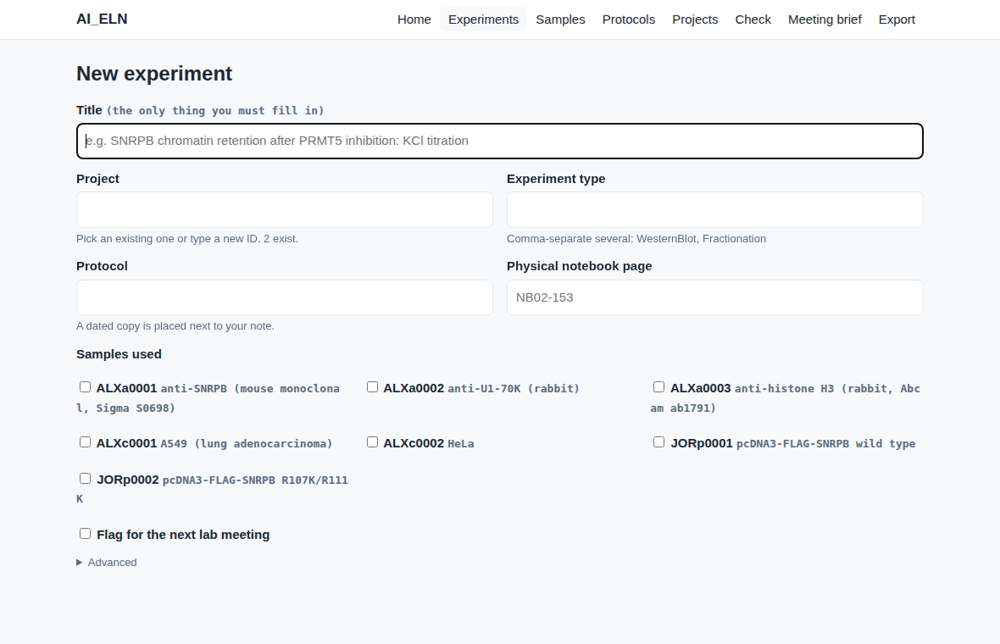

# Getting started

Ten minutes, once. After that, creating an experiment is one double-click
and one form.

## 0. Get the folder onto your computer

Either the lab's shared copy (a synced OneDrive/Dropbox folder — ask
whoever set it up), or download this repository (green **Code** button →
**Download ZIP**, then unzip), or `git clone` it if you know what that is.
Wherever it ends up, that folder is your notebook. Don't move things inside
it around by hand.

## 1. One-time setup for your computer

**Mac.** Python is already there. The first time you double-click a
launcher, macOS will say it's from an unidentified developer: right-click
(or Control-click) the launcher, choose **Open**, then **Open** again
(on the newest macOS: *System Settings → Privacy & Security → Open
Anyway*). Only needed once per launcher, and not at all if the folder came
by OneDrive sync or `git clone`. If a window offers to install *command
line developer tools*, click **Install**; that is Python being set up and
takes a few minutes.

**Windows.** Install Python once from <https://www.python.org/downloads/>
and tick **Add python.exe to PATH** on the first screen of the installer.
Then the launchers just work.

**Linux.** Python 3 is already there; run `python3 scripts/eln_web.py`.

## 2. Open the page

Double-click **`launchers/Open ELN`**. A small window appears and your
browser opens a page like this:


The page runs on your own computer (the address starts with `127.0.0.1`);
nothing leaves it. Leave the small window alone; closing it closes the
page. The first time, it asks for your initials and name under
**settings**. Your initials become your ID prefix (`JSRe0001`, `JSRe0002`,
…), so nobody's numbering collides with anyone else's.

Want to click around first without touching the lab's real record?
Double-click **`launchers/Try the Sandbox`** instead: same page, fictional
data, resettable.

## 3. Create your first experiment

Click **New experiment**. The title is the only thing you must fill in;
everything else can be added later.



Click **Create experiment**. You now have a folder with the five standard
subfolders, a note with the header filled in, a copy of the protocol as it
stood today, and a row in the inventory. The page shows the new note.

## 4. Write in the note

Click **Edit here** on the note's page, write under the section titles,
click **Save**. That is the whole editing workflow if you never want to
see a text editor. (The note is a plain text file, so any editor works
too: **Open in your editor** hands it to whatever your computer uses for
`.md` files.)


Keep the `##` section titles so every experiment in the lab reads the
same way; between them, write however you like. Fill in **Objective**
before you start; **Results**, **Interpretation**, and **Decision** when
you have them. Leave a section as "None" rather than deleting it.

## 5. Put files where they belong, named with the ID

**Show folder** on the note's page opens the experiment folder.

```
2-data_raw/         instrument output. Original filenames. Never edit, never rename.
3-code/             JSRe0001_analysis.R
4-data_processed/   JSRe0001_quantification.csv
5-figures/          JSRe0001_R_fractionation-KCl_20260904.png   <- the results figure (R = "results")
```

Start every file you make with the experiment ID; join words with hyphens.
That single habit is what makes "find me the blot from that experiment" a
one-second search forever. Each subfolder has a short README saying what
goes in it. Full grammar: [`CONVENTIONS.md`](CONVENTIONS.md) §3.

If the raw data is too large to keep here (microscopy, sequencing), leave
it on the institutional storage and put its location in the note's
`raw_data_path` line. A figure you put in `5-figures/` and link from the
Results section shows up on the note's page.

## 6. The rest of the page

| Button | What it does |
|---|---|
| **New sample** | A record for a plasmid, oligo, antibody, cell line, mouse line, peptide, protein prep, slide, or gel. Gets an ID like `JSRp0001`. Tick it in the experiment form from then on. |
| **New protocol** | One living file per protocol, e.g. `Protocols/P_WesternBlot.md`. Edit it in place as it improves; bump the `version` date and add a Change log line. |
| **New project** | The rolled-up state of a research thread; conclusions cite experiment IDs. |
| **Check** | Reads every note and folder and lists what breaks the conventions. `ERROR` = fix it; `WARN` = advice. |
| **Meeting brief** | The lab-meeting document from everything tagged `meeting`, plus the active-experiments table. One click saves it as a file. |
| **Export** | Bundles a project (or all active experiments) into one file to paste into ChatGPT. See [`ai-agents.md`](ai-agents.md). |
| **Experiments / Samples / Protocols / Projects** | Browse and filter. Every ID on every page is a link. |

## 7. When an experiment is finished

Edit the note and change two header lines:

```yaml
status: complete
date_completed: 2026-09-12
```

Make sure Results and Interpretation are written and `raw_data_path` is
somewhere backed up. **Check** will tell you if you forgot one of those.

## 8. The same thing without a browser

Every launcher and every button runs one script. If you prefer a terminal:

```bash
python3 scripts/eln.py init                                # initials, name, where files live
python3 scripts/eln.py new experiment --title "..."         # add --project, --protocol, --samples, --tags meeting ...
python3 scripts/eln.py new experiment --interactive         # asks questions instead
python3 scripts/eln.py new sample --type plasmid --title "..."
python3 scripts/eln.py validate                            # --strict makes warnings fail too
python3 scripts/eln.py find --status active --project PRMT5-ChromatinRelease
python3 scripts/eln.py report
python3 scripts/eln.py export --project PRMT5-ChromatinRelease --out brief.md
python3 scripts/eln_web.py                                 # the page, by hand
```

The terminal-window launchers (`New Experiment`, `Check Everything`, and
so on) are the same commands with questions instead of flags.

## 9. Where the files live

By default, inside this folder — simplest, and fine for a synced OneDrive
or Dropbox copy of the whole folder. If the lab keeps notes somewhere else
(a server mount, a different shared folder), tell the tool once:

```bash
python3 scripts/eln.py init --root "/path/to/ShechterLab/ELN"
```

That writes `~/.ai_eln.json`; the page, the launchers, and every command
use it from then on. `AI_ELN_ROOT` in the environment or `--root` on a
command overrides it for one shell or one call.

## If something doesn't work

- **Mac: "cannot be opened because it is from an unidentified developer"** —
  right-click → Open (once per launcher), or Privacy & Security → Open Anyway.
- **Mac: double-clicking opens the file in a text editor instead of running
  it** — the executable bit was lost in a download or sync. In Terminal:
  `chmod +x` followed by a space, then drag the `launchers` folder into the
  window, add `/*.command`, press Enter. Or run
  `python3 scripts/eln_web.py` directly.
- **Windows: a window flashes and closes, or "python is not recognized"** —
  install Python (§1) with *Add to PATH* ticked, then try again.
- **The page says "First time here"** — click *settings* and enter your
  initials and name.
- **"could not open a port"** — another copy of the page is already
  running; find its window, or close it and try again.
- **Check says a folder "does not match {ID}_{slug}"** — someone made or
  renamed an experiment folder by hand. Rename it to
  `{ID}_{words-with-hyphens}` or recreate it with New experiment.
