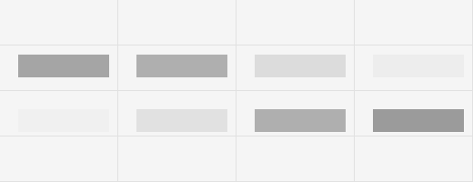

# Fractionation protocol validation: KCl titration in A549

`ALXe0001` · Alex Example · 2026-06-11

## Objective

Validate the fractionation protocol on A549 cells and find the KCl concentration in nucleoplasm buffer at which U1-70K is released from chromatin, so the protocol can be applied to PRMT5i-treated samples.

## Experimental design

A549, untreated. Nucleoplasm buffer at 0, 150, 300, 450 mM KCl. Fractions: cytoplasm, nucleoplasm, chromatin. Blots: U1-70K (target), GAPDH (cytoplasmic control), histone H3 (chromatin control). n = 1.

## Methods

<!-- The protocol you followed is snapshotted next to this file as ALXe0001_P_... .
     Only write what is not in the protocol. Deviations go in the next section. -->

## Deviations from protocol

- None

## Results

GAPDH is cytoplasmic only and H3 chromatin only at every KCl concentration, so the fractionation is clean. U1-70K moves from the chromatin fraction to the nucleoplasm between 150 and 300 mM KCl; at 450 mM the chromatin fraction is nearly empty.

## Interpretation

The protocol separates the compartments as intended and 300 mM KCl is a usable working concentration: enough to see salt-dependent release without stripping everything.

## Decision

Protocol validated at 300 mM KCl (recorded in P_CellularFractionation). Apply to PRMT5i-treated A549 in ALXe0002.

## Follow-up experiments

- [x] ALXe0002

## Files

- Raw data: `Experiments/ALXe0001_Fractionation-protocol-validation-KCl-titration-in-A549/2-data_raw`
- Analysis: `3-code/`
- Processed data: `4-data_processed/`
- Figures: `5-figures/`
